# 🏡 **Helle 2-Zimmer-Wohnung mit Tiefgarage in Linz-Urfahr/St. Magdalena (Gründberg)**

# English version below

Diese **helle und gepflegte** 2-Zimmer-Wohnung mit ca. **49 m²** befindet sich im **2. Stock** eines Wohnhauses in **Linz-Urfahr**. Die Räume sind lichtdurchflutet und angenehm warm – ideal für ein komfortables Zuhause.

Die Wohnung liegt nur **100 Meter von der Straßenbahnstation „Gründberg“** entfernt. Die Straßenbahn bringt Sie in ca. **10 Minuten zur JKU Universität** und in ca. **15 Minuten ins Stadtzentrum**, viele lokale Wanderwege in der Natur beginnen in der Nähe. Perfekt für Berufstätige, Studierende oder Paare.

Zur Wohnung gehört ein **Tiefgaragenstellplatz**, der **bereits im Mietpreis inkludiert** ist.

---

## 📌 **Daten zur Wohnung**

- **Wohnfläche:** ca. 49 m²
- **Zimmer:** 2 (Wohnzimmer + Schlafzimmer)
- **Etage:** 2. Stock
- **Lift:** Ja
- **Küche:** möbliert, Küchengeräten ausgestattet
- **Bad/WC:** Badezimmer und WC (getrennt)
- **Balkon:** kein Balkon vorhanden
- **Heizung:** Fernwärme
- **Zustand:** sehr gut, hell, freundlich
- **Bezug:** ab sofort möglich
- **Lage:** 100 m zur Straßenbahn (Gründberg), schnelle Verbindung zur JKU und ins Zentrum
- **Art:** **privat – provisionsfrei**

---

## 💶 **Kosten**

- **Gesamtmiete inkl. Betriebskosten:** € **750 / Monat**  
  Die Betriebskosten beinhalten alle gebäudebezogenen Kosten, ausgenommen Strom.
- **Kaution:** **3 Monatsmieten** → € **2.250**
- **Provision:** **keine** (direkt vom Eigentümer)

---

## ⭐ **Ideal für**

- Einzelpersonen
- Paare
- Studenten und Studentinnen

---

# 🏡 Bright 2-Room Apartment with Underground Parking in Linz-Urfahr/St. Magdalena (Gründberg)

This bright and well-maintained 2-room apartment with approx. 49 m² is located on the 2nd floor of a residential building in Linz-Urfahr. The rooms are full of natural light (big windows) and warm – ideal for a comfortable home.

The apartment is just around 100 meters from the tram station “Gründberg.” It takes around 10 minutes to get to the JKU University and around 15 mins to the city center. There are some local walking/hiking trails nearby, a forest is accessible just in a 10-mins walk. The flat should be a good fit for a single persion, students, or couples.

An underground parking space is included in the rental price.

---

## 📌 Apartment Details

**Living area:** approx. 49 m²
**Rooms:** 2 (living room + bedroom)
**Floor:** 2nd floor
**Elevator:** Yes
**Kitchen:** fully furnished with standard appliances
**Bathroom/WC:** bathroom and WC separated
**Balcony:** none
**Heating:** district heating (Fernwärme)
**Condition:** very good, bright, friendly
**Available:** immediately
**Location:** 100 m to tram stop “Gründberg,” fast connection to JKU and the city center
**Type:** private – no commission

---

## 💶 Costs

**Total rent incl. operating costs (BK): € 750 / month**
(Operating costs (BK) include all building-related expenses except electricity)
**Deposit:** 3 monthly rents → € 2,250

---

## ⭐ Ideal for

* Single occupants
* Couples
* Students

# Contacts

Tel.: +436503484035 (Ivan)
 
Email: zorin.ial@gmail.com

# Photos

**Photo 1**

  
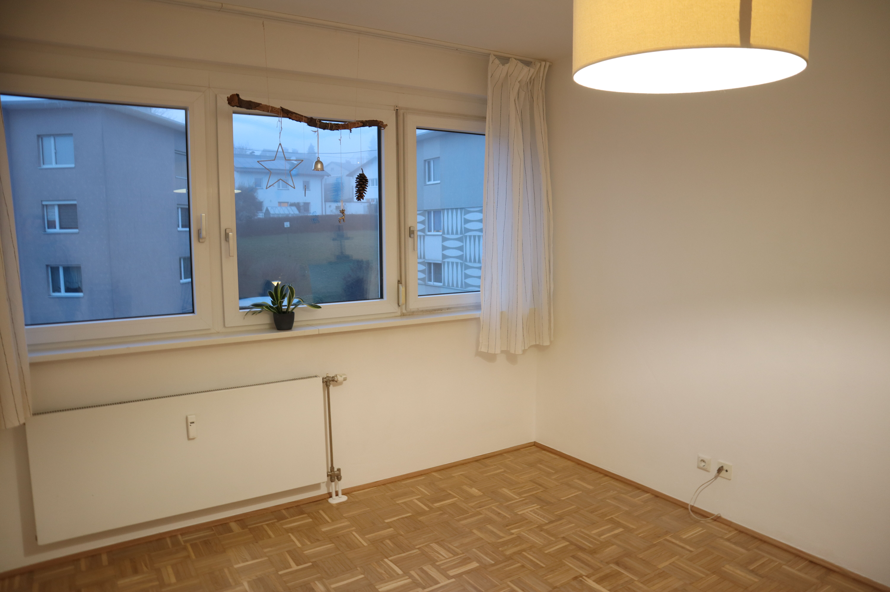

**Photo 2**  
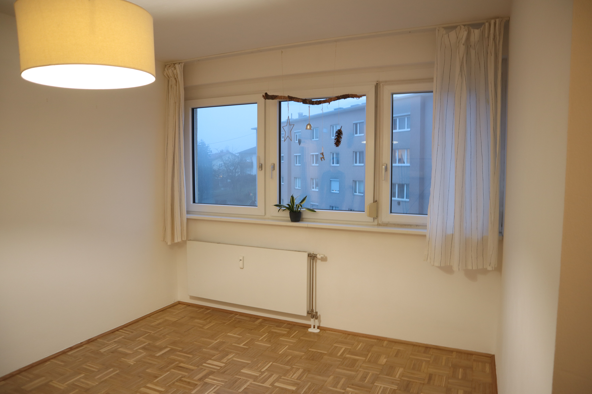

**Photo 3**  
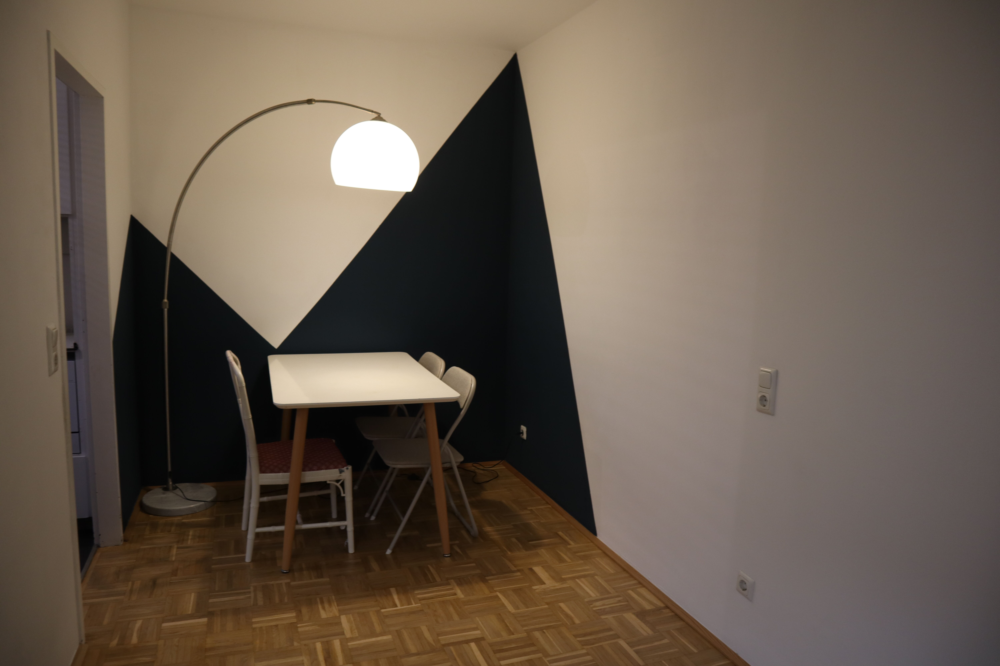

**Photo 4**  
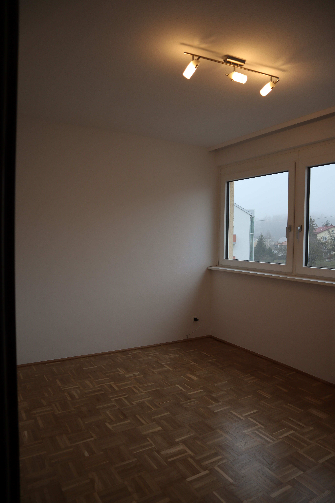

**Photo 5**  
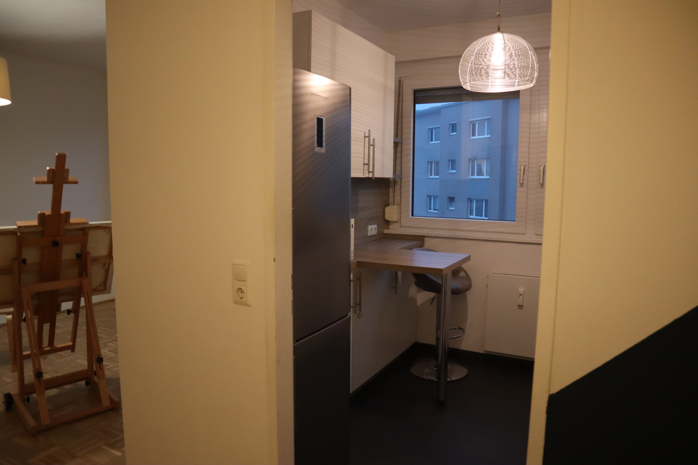

**Photo 6**  
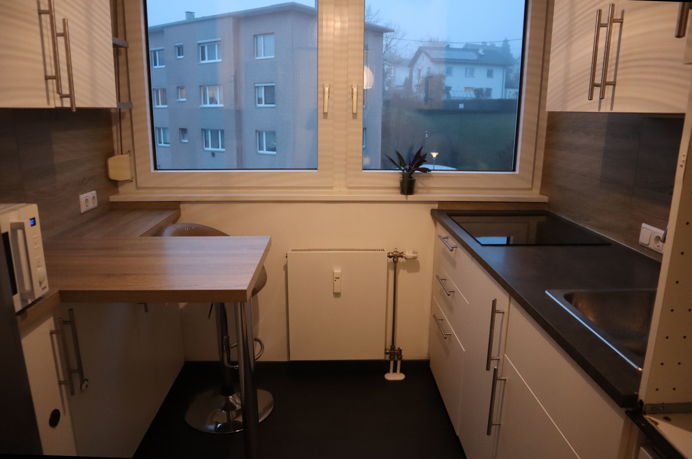

**Photo 7**  
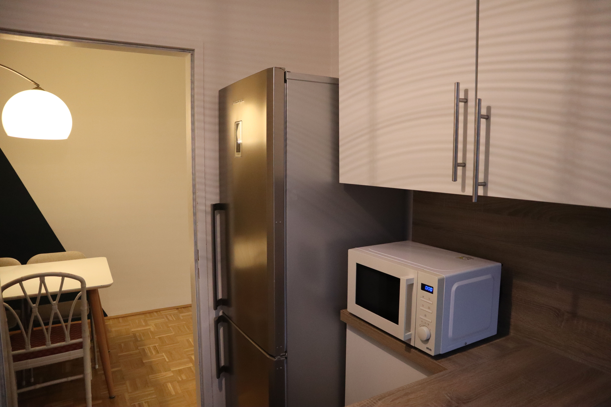

**Photo 8**  
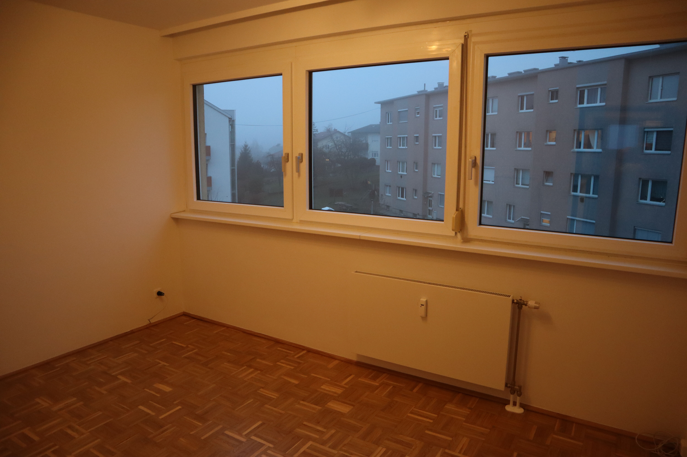

**Photo 9**  
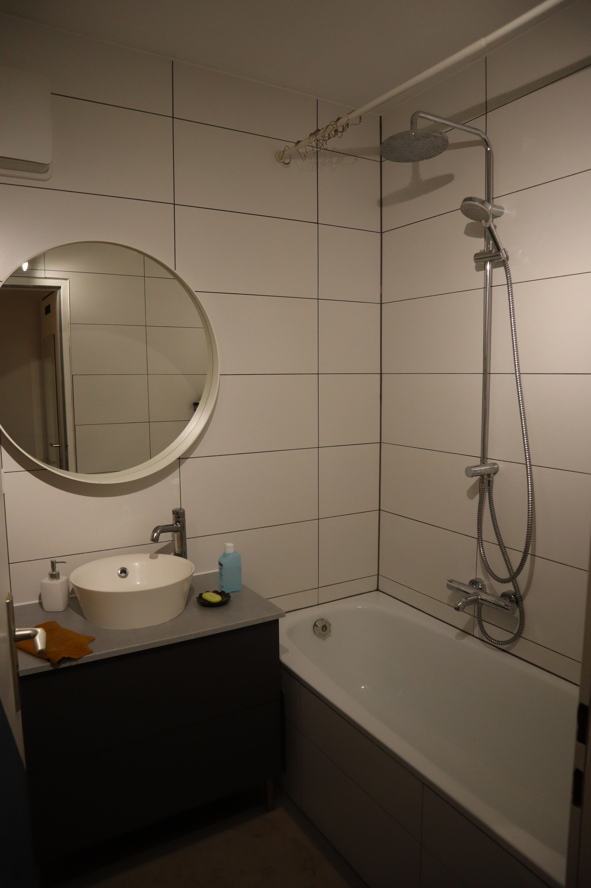

**Photo 10**  
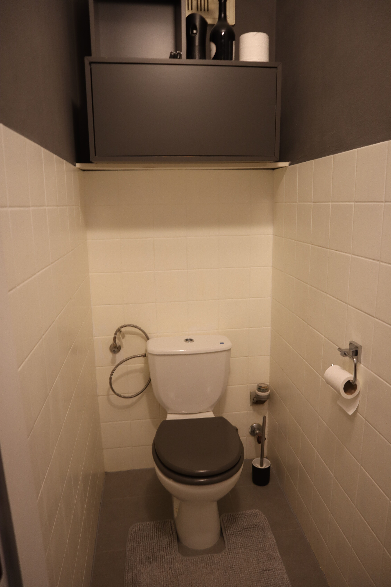

**Photo 11**  
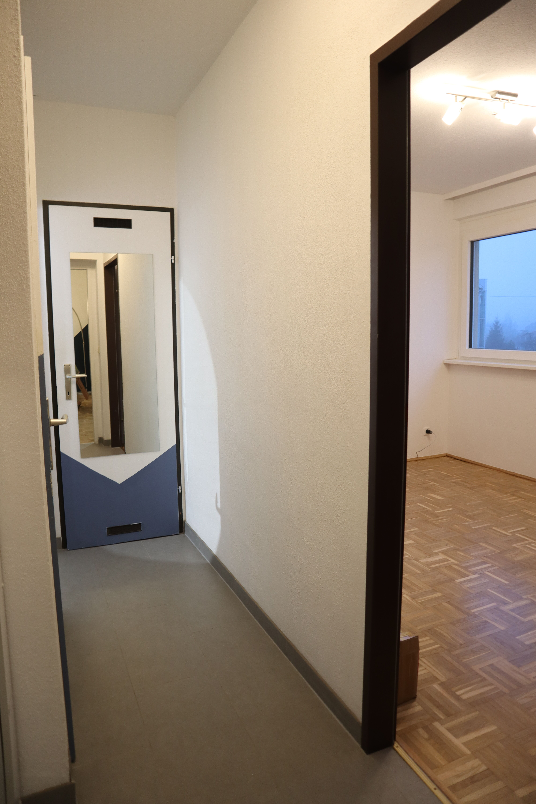

**Photo 12**  
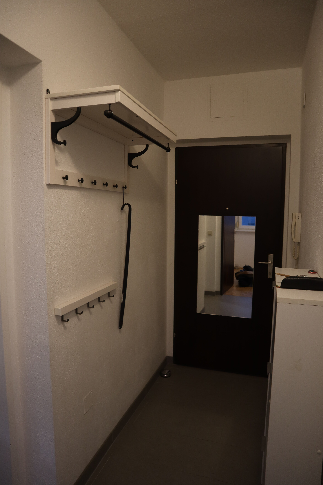

**Photo 13**  
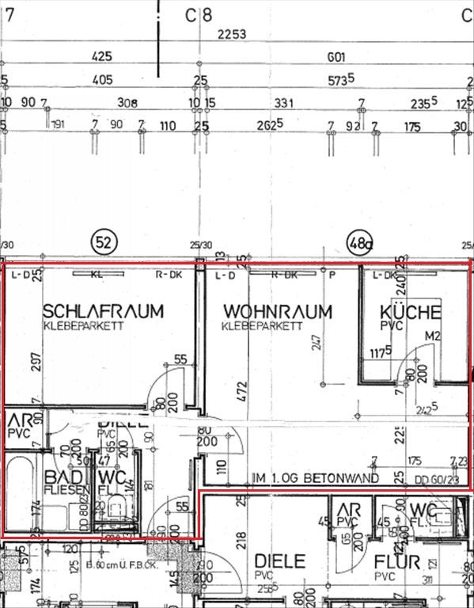